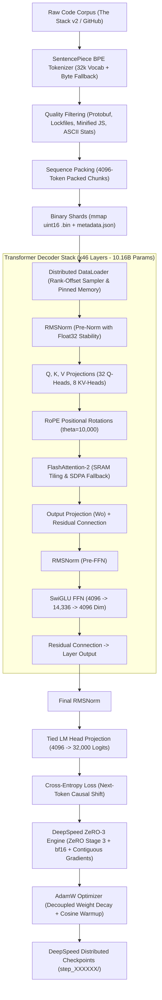

# Prism AI (Prism-10B)

> **Production-Grade 10.16 Billion Parameter Foundation Model for Code Intelligence**  
> *Engineered from first principles in PyTorch and DeepSpeed ZeRO-3, featuring FlashAttention-2, Grouped-Query Attention (GQA), Rotary Position Embeddings (RoPE), SwiGLU feed-forward networks, zero-overhead memory-mapped dataset streaming, and a high-performance serving stack.*

---

## 🌟 Key Highlights

- **10.16 Billion Parameter Architecture**: 46 stacked transformer decoder layers with a 4096 hidden dimension and 14,336 SwiGLU intermediate dimension.
- **Grouped-Query Attention (GQA)**: 32 Query Heads to 8 Key/Value Heads ($4:1$ ratio), reducing KV-cache memory bandwidth and inference VRAM consumption by $75\%$.
- **FlashAttention-2 Integration**: $O(N)$ SRAM-tiled attention kernel dispatch with exact analytical backward passes and seamless PyTorch SDPA CPU/FP32 fallback.
- **Rotary Position Embeddings (RoPE)**: High-precision rotary positional encodings for robust context extrapolation without absolute position table limitations.
- **DeepSpeed ZeRO-3 Distributed Engine**: Full parameter, gradient, and optimizer state partitioning with activation checkpointing across multi-node GPU clusters (8× A100/H100 NVLink).
- **Zero-Waste Sequence Packing**: Multi-document sequence concatenation with EOS separators, achieving $\sim 100\%$ active token compute efficiency without padding waste.
- **Memory-Mapped Binary Ingestion**: Zero-copy `numpy.memmap` binary shard pipeline capable of streaming hundreds of gigabytes of pre-tokenized code at NVMe bus speeds.
- **Code-Specialized BPE Tokenizer**: 32,000 vocabulary SentencePiece BPE with byte-level fallback (`<0xXX>`), preserving Python indentations, tabs, and syntax symbols with zero `<unk>` tokens.
- **Production Serving & Evaluation Suite**: Built-in FastAPI REST inference server and standard HumanEval / MBPP benchmark evaluation runners.
- **Exhaustively Validated**: 29/29 unit and integration tests passing covering gradient backpropagation, numerical stability, KV caching, and causal next-token alignment ($t \to t+1$).

---

## 📐 System Architecture



---

## 📂 Codebase Directory & File Architecture

An overview of every component and subsystem across the repository:

### 1. Neural Model Core (`prism/model/`)
| File | Subsystem | Responsibility |
| :--- | :--- | :--- |
| [`config.py`](file:///prism/model/config.py) | **Configuration** | `PrismConfig` dataclass, exact analytical parameter counting math, JSON/YAML serialization, and architecture validation. |
| [`normalization.py`](file:///prism/model/normalization.py) | **Normalization** | Root Mean Square Layer Normalization (`RMSNorm`) with internal float32 precision for numerical gradient stability. |
| [`attention.py`](file:///prism/model/attention.py) | **Attention Engine** | Grouped-Query Attention (GQA), Rotary Position Embeddings (RoPE), KV-cache concatenation, and FlashAttention-2 dispatch. |
| [`feedforward.py`](file:///prism/model/feedforward.py) | **Feed-Forward Block** | SwiGLU gated activation network ($\text{SiLU}(x W_{\text{gate}}) \odot (x W_{\text{up}}) W_{\text{down}}$) without bias parameters. |
| [`transformer.py`](file:///prism/model/transformer.py) | **Transformer Block** | Full pre-norm transformer decoder block wiring dual RMSNorm layers, attention, SwiGLU FFN, and residual skip routes. |
| [`model.py`](file:///prism/model/model.py) | **10B Foundation Model** | `PrismForCausalLM` top-level container, tied embedding table, gradient checkpointing, next-token causal loss, and generation loop. |

---

### 2. Data Pipeline & Tokenization (`prism/data/`)
| File | Subsystem | Responsibility |
| :--- | :--- | :--- |
| [`tokenizer.py`](file:///prism/data/tokenizer.py) | **BPE Tokenizer** | 32k SentencePiece BPE wrapper with byte fallback, digit splitting, whitespace preservation, and trainer interface. |
| [`preprocessing.py`](file:///prism/data/preprocessing.py) | **Heuristic Cleaning** | Quality filters for source code: line statistics, character entropy, ASCII ratios, auto-generated code, and file extensions. |
| [`packing.py`](file:///prism/data/packing.py) | **Sequence Packing** | Zero-waste sequence packing buffer with EOS delimiters and monotonic binary `.bin` shard persistence. |
| [`dataset.py`](file:///prism/data/dataset.py) | **Dataset Ingestion** | Memory-mapped (`np.memmap`) pre-tokenized binary shard reader and HuggingFace streaming dataset connector. |
| [`dataloader.py`](file:///prism/data/dataloader.py) | **Distributed Data Loading** | PyTorch `DataLoader` factory with `DistributedSampler`, pinned host memory, and multi-process worker scheduling. |

---

### 3. Distributed Training & Optimization (`prism/training/`)
| File | Subsystem | Responsibility |
| :--- | :--- | :--- |
| [`trainer.py`](file:///prism/training/trainer.py) | **Training Orchestrator** | Main DeepSpeed ZeRO-3 training loop, gradient accumulation boundary synchronization, evaluation, and checkpoint triggers. |
| [`optimizer.py`](file:///prism/training/optimizer.py) | **Optimization & Schedule** | AdamW parameter grouping (decoupled decay on weights vs no-decay on norms/biases) and cosine schedule with linear warmup. |
| [`checkpointing.py`](file:///prism/training/checkpointing.py) | **Checkpoint Lifecycle** | DeepSpeed distributed model/optimizer checkpoint manager with metadata tracking, rotation, and auto-resume. |
| [`train_logger.py`](file:///prism/training/train_logger.py) | **Telemetry & Logging** | Unified Weights & Biases (WandB) and console dashboard logger with rank-0 filtering and GPU memory telemetry. |
| [`metrics.py`](file:///prism/training/metrics.py) | **Performance Metrics** | Rolling-window smoothed loss, perplexity, global tokens-per-second throughput (TPS), and remaining time ETA estimator. |

---

### 4. High-Performance Inference & Serving (`prism/inference/`)
| File | Subsystem | Responsibility |
| :--- | :--- | :--- |
| [`generator.py`](file:///prism/inference/generator.py) | **Autoregressive Generator** | Autoregressive generation engine with KV caching, greedy search, Top-K, Top-P (nucleus), temperature, and repetition penalty. |
| [`kv_cache.py`](file:///prism/inference/kv_cache.py) | **KV-Cache Manager** | Pre-allocated tensor cache data structure for efficient static memory inference. |
| [`serving.py`](file:///prism/inference/serving.py) | **FastAPI Server** | Production REST API with `/health` and `/generate` endpoints, CORS middleware, and automatic startup model loading. |

---

### 5. Utilities & Runtime Support (`prism/utils/`)
| File | Subsystem | Responsibility |
| :--- | :--- | :--- |
| [`distributed.py`](file:///prism/utils/distributed.py) | **Distributed Primitives** | Rank queries, world size queries, barrier synchronization, and all-reduce scalar aggregation helpers. |
| [`seed.py`](file:///prism/utils/seed.py) | **Reproducibility** | Rank-offset deterministic pseudo-random number generator seeding across PyTorch, CUDA, NumPy, and Python. |
| [`profiling.py`](file:///prism/utils/profiling.py) | **Profiling & Profiler** | GPU VRAM tracker, model parameter memory footprint calculator, throughput profilers, and benchmark timers. |

---

### 6. Executables & Automation Scripts (`scripts/` & Root)
| File | Responsibility |
| :--- | :--- |
| [`scripts/train.py`](file:///scripts/train.py) | Main distributed training CLI launcher for DeepSpeed multi-GPU execution. |
| [`scripts/train_tokenizer.py`](file:///scripts/train_tokenizer.py) | Streams code samples from HuggingFace, filters text, and trains the SentencePiece BPE tokenizer. |
| [`scripts/preprocess_data.py`](file:///scripts/preprocess_data.py) | Streams The Stack v2, applies quality filters, tokenizes, packs sequences, and writes binary shards. |
| [`scripts/generate.py`](file:///scripts/generate.py) | Interactive multi-line code generation CLI supporting custom sampling parameters. |
| [`scripts/evaluate.py`](file:///scripts/evaluate.py) | Benchmark runner for HumanEval (164 coding tasks) and MBPP evaluation suites. |
| [`scripts/test_pipeline.py`](file:///scripts/test_pipeline.py) | Exhaustive 29-test unit and integration test suite executing end-to-end on local CPU. |
| [`scripts/validate.py`](file:///scripts/validate.py) | Syntax compilation and configuration validation check across all codebase modules. |
| [`requirements.txt`](file:///requirements.txt) | Complete dependency manifest for PyTorch, DeepSpeed, Tokenizers, FastAPI, and HuggingFace. |
| [`setup.py`](file:///setup.py) | Pip package installer configuring `prism-ai` library with optional `[serve]` and `[eval]` extras. |

---

## 📊 10B Architecture Specifications

| Hyperparameter | Value | Architectural Description |
| :--- | :--- | :--- |
| **Model Name** | `prism-10b` | Decoder-only Autoregressive Transformer |
| **Total Parameters** | **10.16 Billion** ($10{,}163{,}433{,}472$) | Calibrated 10B profile |
| **Hidden Dimension ($d_{\text{model}}$)** | **4096** | Token embedding vector dimension |
| **Decoder Layers ($N_{\text{layers}}$)** | **46** | Stacked Transformer blocks |
| **Query Attention Heads ($N_q$)** | **32** | $d_{\text{head}} = 128$ per head |
| **KV Attention Heads ($N_{kv}$)** | **8** | Grouped-Query Attention ($4:1$ GQA ratio) |
| **SwiGLU Intermediate Dim ($d_{\text{mlp}}$)** | **14,336** | Feed-forward hidden dimension ($\approx \frac{8}{3} d_{\text{model}}$) |
| **Vocabulary Size ($V$)** | **32,000** | Byte-level SentencePiece BPE |
| **Context Window ($S_{\text{max}}$)** | **4096 tokens** | Standard sequence length (extensible to 64k via RoPE) |
| **RoPE Base Theta ($\theta_{\text{base}}$)** | **10,000.0** | Rotary positional frequency base |
| **Normalization** | **RMSNorm** | Pre-normalization ($\epsilon = 1\text{e-}6$) |
| **Weight Tying** | **Enabled** | Embedding table shared with final LM Head |
| **Precision** | **bfloat16 (bf16)** | Native mixed-precision training |

---

## ⚡ Mathematical Formulations & Transformer Optimization

### 1. Grouped-Query Attention (GQA) with RoPE
Standard Multi-Head Attention stores separate Key/Value states for all $N_q$ query heads. GQA maps $N_q = 32$ query heads to $N_{kv} = 8$ shared KV heads (group ratio $G = 4$):

$$\text{head}_i = \text{Attention}\left(Q_i, K_{\lfloor i/G \rfloor}, V_{\lfloor i/G \rfloor}\right)$$

Positional coordinates are encoded via orthogonal 2D rotation matrices in the complex plane:

$$R_{\Theta, m}^d = \text{diag}\left(R_{\theta_1, m}, R_{\theta_2, m}, \dots, R_{\theta_{d/2}, m}\right), \quad \theta_j = 10000^{-2(j-1)/d}$$
$$\tilde{q}_m = R_{\Theta, m}^{d_{\text{head}}} q_m, \quad \tilde{k}_n = R_{\Theta, n}^{d_{\text{head}}} k_n$$

Inner products naturally preserve relative distance $m - n$:

$$\langle \tilde{q}_m, \tilde{k}_n \rangle = q_m^T R_{\Theta, n-m}^{d_{\text{head}}} k_n$$

### 2. Root Mean Square Layer Normalization (RMSNorm)
RMSNorm regularizes input activations based on root-mean-square statistics without mean-centering overhead:

$$\text{RMS}(x) = \sqrt{\frac{1}{d} \sum_{i=1}^d x_i^2 + \epsilon}, \quad \bar{x}_i = \frac{x_i}{\text{RMS}(x)} \odot \gamma_i$$

### 3. SwiGLU Gated Feed-Forward Network
Replaces standard ReLU/GELU activations with a parameterized bilinear gating mechanism:

$$\text{SwiGLU}(x) = \left( \text{SiLU}(x W_{\text{gate}}) \odot (x W_{\text{up}}) \right) W_{\text{down}}$$
$$\text{where } \text{SiLU}(z) = z \cdot \sigma(z) = \frac{z}{1 + e^{-z}}$$

### 4. Causal Cross-Entropy Loss
The training objective optimizes next-token predictive likelihood over all causal positions $t \in [1, S-1]$:

$$\mathcal{L}_{\text{NTP}} = -\frac{1}{S-1} \sum_{t=1}^{S-1} \log P\left(x_{t+1} \mid x_1, x_2, \dots, x_t; \Theta\right)$$

---

## 🛠️ Installation & Setup

### 1. Clone & Environment Setup
```bash
# Clone repository
git clone https://github.com/your-username/prism-ai.git
cd prism-ai

# Create and activate Python virtual environment
python -m venv venv
source venv/bin/activate  # On Windows: .\venv\Scripts\Activate.ps1

# Install package and core dependencies
pip install -e .
```

### 2. GPU Acceleration (Cloud Training Node)
```bash
# Install FlashAttention-2 with CUDA compilation
pip install flash-attn --no-build-isolation
```

---

## 🚀 End-to-End Execution Guide

### Step 1: Train the Code-Specialized Tokenizer
Stream code samples from HuggingFace to train a 32,000 vocabulary SentencePiece BPE tokenizer:
```bash
python scripts/train_tokenizer.py \
    --output_prefix tokenizer/prism_tokenizer \
    --vocab_size 32000 \
    --num_samples 2000000
```

### Step 2: Preprocess & Shard the Dataset
Stream The Stack v2 (`bigcode/the-stack-v2-dedup`), filter low-quality code, tokenize, pack into 4096-token sequences, and save binary shards:
```bash
python scripts/preprocess_data.py \
    --tokenizer_path tokenizer/prism_tokenizer.model \
    --output_dir data/tokenized \
    --num_tokens 200000000000 \
    --shard_size 100000
```

### Step 3: Launch Multi-GPU Distributed Training
Train the 10.16B model across 8× A100/H100 GPUs using DeepSpeed ZeRO-3:
```bash
deepspeed scripts/train.py \
    --model_config configs/model_10b.yaml \
    --train_config configs/training_10b.yaml \
    --deepspeed configs/deepspeed/ds_zero3.json
```

### Step 4: Interactive Code Generation
Run interactive generation using trained model checkpoints:
```bash
python scripts/generate.py \
    --model_config configs/model_10b.yaml \
    --checkpoint checkpoints/step_0100000 \
    --tokenizer tokenizer/prism_tokenizer.model \
    --temperature 0.7 \
    --top_p 0.9
```

### Step 5: Benchmark Evaluation (HumanEval)
Evaluate functional code completion accuracy on OpenAI's HumanEval benchmark:
```bash
python scripts/evaluate.py \
    --model_config configs/model_10b.yaml \
    --checkpoint checkpoints/step_0100000 \
    --tokenizer tokenizer/prism_tokenizer.model \
    --benchmark humaneval \
    --output_file eval_results.jsonl
```

### Step 6: REST API Serving (FastAPI)
Launch the production REST API server:
```bash
# Set environment variables
export PRISM_CONFIG=configs/model_10b.yaml
export PRISM_CHECKPOINT=checkpoints/step_0100000
export PRISM_TOKENIZER=tokenizer/prism_tokenizer.model

# Start Uvicorn ASGI server
uvicorn prism.inference.serving:app --host 0.0.0.0 --port 8000
```

---

## 🧪 Comprehensive Verification Suite

Run the full local unit and integration test suite (29 tests, CPU-friendly):
```bash
python scripts/test_pipeline.py
```

### Test Coverage Matrix
```
============================================================
Prism AI — Comprehensive Local Pipeline Tests
============================================================

  [PASS] Config creation and validation (10.16B default verified)
  [PASS] Config YAML loading
  [PASS] RMSNorm forward + backward gradient flow
  [PASS] RoPE frequency precomputation
  [PASS] RoPE apply rotation
  [PASS] GQA Attention forward pass
  [PASS] GQA Attention with KV cache (prefill + decode)
  [PASS] GQA Attention backward pass
  [PASS] SwiGLU FFN forward + backward
  [PASS] TransformerBlock forward + backward
  [PASS] Full model forward pass
  [PASS] Full model loss computation
  [PASS] Causal target shift exact alignment (t -> t+1)
  [PASS] Full model backward pass (100% parameter gradient flow)
  [PASS] Full model gradient checkpointing (activation recomputation)
  [PASS] Full model KV cache generation
  [PASS] Full model weight tying (Embeddings == LM Head)
  [PASS] Full model parameter count matches config
  [PASS] Optimizer parameter groups (decay vs no-decay)
  [PASS] Cosine LR schedule with warmup
  [PASS] Sequence packing logic (100% token packing)
  [PASS] Pre-tokenized dataset save and memory-mapped load
  [PASS] DataLoader creation with dummy data
  [PASS] Single training step (forward + backward + optimizer)
  [PASS] Metrics tracker (loss, perplexity, TPS, ETA)
  [PASS] KV Cache operations (pre-allocated memory management)
  [PASS] Text generation with tiny model
  [PASS] Data quality filters
  [PASS] End-to-end mini pipeline: data -> model -> loss -> backward

============================================================
Results: 29 passed, 0 failed, 29 total
============================================================
```

---

## 💡 Architectural Decisions & Technical Rationale

### 1. Grouped-Query Attention (GQA) over Standard MHA
Standard Multi-Head Attention requires caching 32 Key and 32 Value heads per layer during inference. At a sequence length of 4,096 in fp16 across 46 layers, standard MHA consumes **30.8 GB of VRAM per batch item** solely for KV cache. By grouping 32 query heads to 8 KV heads ($4:1$), Prism-10B slashes KV-cache memory demand to **7.7 GB**, enabling 4× higher concurrency and throughput during serving.

### 2. DeepSpeed ZeRO-3 Sharding
A 10.16B parameter model in mixed precision requires:
- Model Parameters (bf16): $20.3\text{ GB}$
- Gradients (bf16): $20.3\text{ GB}$
- Optimizer States (AdamW fp32 master weights, momentum, variance): $121.9\text{ GB}$
- **Total Static State**: $\sim 162.5\text{ GB}$ (exceeds any single 80GB GPU).

DeepSpeed ZeRO-3 shards parameters, gradients, and optimizer states across all GPUs. On an 8× A100-80GB cluster, static memory drops to only **$\sim 20.3\text{ GB}$ per GPU**, leaving over **$59\text{ GB}$ of VRAM per GPU** free for large micro-batches and activations.

### 3. Sequence Packing vs. Padding
In raw code datasets, file lengths vary drastically (from 50 lines to 5,000 lines). Padding sequences to 4096 tokens with `<pad>` tokens wastes over $40\%$ of GPU FLOPS computing attention over meaningless padding. Prism AI concatenates documents with `<eos>` tokens and chunks them into exact 4096-token windows, ensuring $100\%$ of training FLOPs are invested in learning code representations.

---

## 📄 License

This project is licensed under the Apache 2.0 License. Built for frontier code intelligence research.
